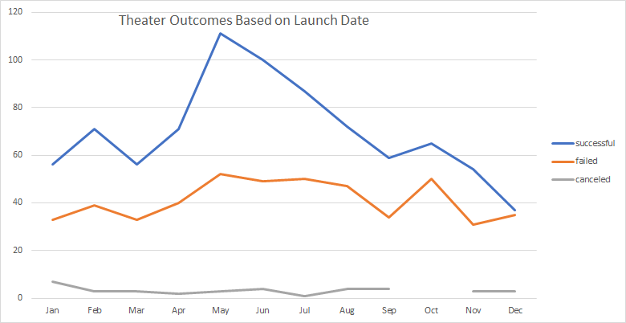
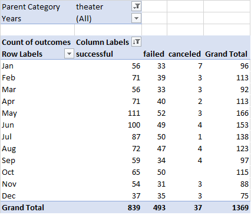
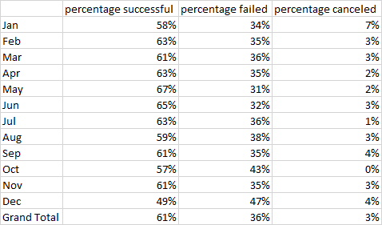
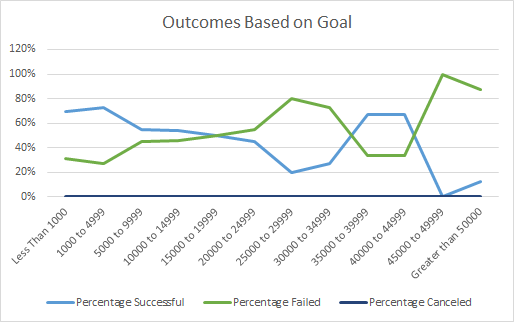

# An Analysis of Kickstarter Campaigns
Performing analysis on Kickstarter data to uncover trends

## Overview of Project
### Purpose
Kickstarter data was used to perform an analysis on the potential relationships between a campaign’s launch date and funding goals to their campaign outcomes. Knowing the time of year to launch a Kickstarter may be a fundamental key to success as well as knowing a realistic funding goal. Louise is mainly concerned with Theater and Plays thus will be the focus of the analysis. 

## Analysis and Challenges
### General

For the purpose of this analysis, live campaigns are omitted from the data set. Live campaign data does not provide any insight into campaign outcomes for Louise. 

In total, there are 1,369 theater campaigns in the Kickstarter data set.  Out of this data, there are 839 successful campaigns (61%) and 493 failed campaigns (36%). Out of the three categories under theater, plays contributed the most. Drilling deeper into the play subcategory, there is a total of 1,047 campaigns with 694 (51%) successful and 353 (26%) failed campaigns. There are no canceled campaigns in the play category but there is a total of 37 failed campaigns in the whole theater parent category.

### Analysis of Outcomes Based on Launch Date

For this analysis, the outcome of each campaign in the Theater category was compared to their launch date for the purpose of determining if dates have an impact on outcome. 

There appears to be a strong correlation between the time of year and success of a campaign. There is a significant spike in the number of successful campaigns between the months of April and July. The number of successful campaigns has doubled failed campaigns for this time period. This analysis shows it would be wise to launch a campaign between these months for a potentially higher success rate. However, for cancelled campaigns there is no evident relationship with launch dates. Therefore, there are other factors that attribute to a canceled campaign. There is a similar lack of relationship between the number of failed campaigns and the launch date. In comparison to the number of successful campaigns, the number of cancelled campaigns stays relatively the same throughout the year. Further analysis of what contributes to a campaign failed outcome is needed. 

#### Challenges and Difficulties Encountered

There is a small increase in the number of failed campaigns around the same time period of April through June where we see the biggest spike in successful campaigns. However, this isn’t troubling because the total number of campaigns increases significantly for these months. The percentage of failed campaigns stays relatively stable throughout the year at around 35%. This analysis shows that successful outcomes can be highly impacted by the time of year.

### Analysis of Outcomes Based on Goals

To determine a campaign’s outcome, the funding goal must be reached. This analysis compares the funding goal to the outcome to determine any impact the funding goal might have for the subcategory Plays. Right off the bat, there have been no canceled Play campaigns therefore no observations can be made. Per the graph, funding goals of $19,999 or less have a higher success rate than failed. However, in the $10,000 to $19,999 range the percentage of successful and failed are relatively close. This is a risky range for a funding goal. Goals below $9,999 have a much higher chance of success. The goal range of $1,000 to $4,999 has the highest number of campaigns 534, with the highest number of successful outcomes 388 (73%). It also has the highest number of failed outcomes is 146, however it only makes up 27% of the total projects for this range. It appears that an overly ambitious funding goal is not wise for play campaigns. The failed percentage rises significantly from around 40% to 60%-80% by increasing the funding goal above $20,000.

#### Challenges and Difficulties Encountered

There is a significantly higher number of campaigns with a lower funding goal. Therefore, it is hard to compare percentages with a funding goal of 204 projects to a funding goal with only 1 project. Per the graph, there appears to be a spike in successful campaigns in the $40,000-$44,999 range however there was only 3 total projects. With only 3 projects, the data is very small and not as reliable. This analysis has flaws but it does provide a general idea. There must be other crucial reasons as to why Play campaigns typically don’t have a higher funding goal. With that in mind, and the higher success rate of campaigns with a lower funding goal, future campaigns can make an educated decision when determining their goal. 

## Results

### Overview

Between the months of April and July, there is a significantly higher number of campaigns with a success outcome than any other time of year. Therefore, if a campaign has a flexible schedule, it would be wise to launch in those summer months. The time of year doesn’t appear to affect the failed and cancelled outcomes and more analysis would be needed to determine the cause of a failed campaign. There is also a pattern of more campaigns launching in the summer months than any other time of year, in fact some months double that of January and December. Theater campaigns have a seasonal trend of launch and success. 

There is a substantial amount of Play campaigns with a funding goal below $20,000. On the other hand, there are only 62 campaigns with a goal higher than $20,000 out of a total of 1065 campaigns. That is only 6% of the total campaigns. Not only is there a higher number of campaigns with a lower goal, but there is also a higher percentage of successful outcomes then failed outcomes. Based on this, there is a higher risk of choosing a higher funding goal and very little data to go off. There is a key reason to why Plays have a higher success rate at a lower funding goal and more analysis would be needed to determine why. However, with both stats, a campaign can conclude a realistic outcome based on their funding goal and it would be sensible to choose a lower funding goal if possible. 

### Key Findings

* Theater Kickstarters have an overall higher rate of success then failure. Pursuing a campaign in this category would be sensible.
* Summer launch dates have historically been more successful than plays launched in the winter months. If possible, launch campaign in the summer months.
* Higher funding goals are not as successful as lower funding goals. Reducing a higher goal may lead to a higher chance of success.

### Limitations of the Dataset

There is no data of the campaign itself available for analysis. There could be many reasons that contribute to a failed campaign outside of the Kickstarter data. For example, a campaign could have failed because there wasn’t enough publicity despite having launched in the summer months with a goal of $5,000. 

The data also included several Kickstarters that were live during analysis. This data was of no use in determining the success or failure of campaigns. 

### Possible analysis 

It could be beneficial to analyze outcomes based on length of the campaign based on launch date and the predetermined deadline. The length of the campaign may be a key factor of success. 
In addition, analyzing the stats on the pledged amount to the number of backers can give us an idea of what contributed to success. For example, if there were a lower number of backers with a high pledge amount that might indicate the campaign was only successful because of that backer and could be difficult to recreate. Furthermore, campaigns with a lot of backers could indicate what types of campaigns tend to be more successful or a favorite to donors.
