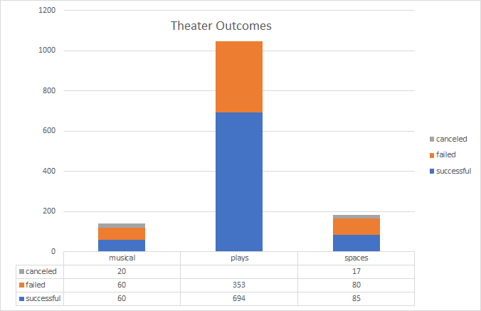

# An Analysis of Kickstarter Campaigns
Performing analysis on Kickstarter data to uncover trends

## Overview of Project
### Purpose
Kickstarter data was used to perform an analysis on the potential relationships between a campaign’s launch date and funding goals to their campaign outcomes. Knowing the time of year to launch a Kickstarter may be a fundamental key to success as well as knowing a realistic funding goal. Louise is mainly concerned with Theater and Plays thus will be the focus of the analysis. 

## Analysis and Challenges
### General
For the purpose of this analysis, live campaigns are omitted from the data set. Live campaign data does not provide any insight into campaign outcomes for Louise. 
In total, there are 1,369 theater campaigns in the Kickstarter data set.  Out of this data, there are 839 successful campaigns (61%) and 493 failed campaigns (36%). Out of the three categories under theater, plays contributed the most. Drilling deeper into the play subcategory, there is a total of 1,047 campaigns with 694 (51%) successful and 353 (26%) failed campaigns. There are no canceled campaigns in the play category but there is a total of 37 failed campaigns in the whole theater parent category.

